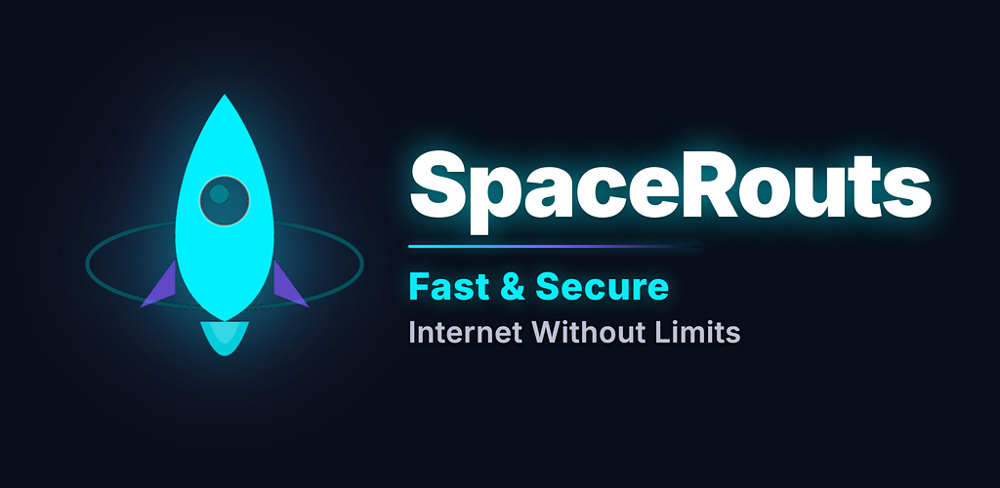

# SpaceRouts VPN

**Fast and reliable VPN service for restrictive regions**

---

## About

[SpaceRouts VPN](https://spacerouts.com) is a fast and reliable VPN service designed for users who need stable internet access in restrictive regions. Modern infrastructure, high speeds, multi-platform support.

## Features

- **High speed** — up to 500 Mbps, unlimited bandwidth
- **Stable connection** — works where most commercial VPNs fail
- **All platforms** — iOS, Android, Windows, macOS
- **European servers** — low latency, high uptime
- **No logs** — strict no-logging policy

## Unblock Popular Services

| Service | Status |
|---------|--------|
| Instagram | Unblocked |
| YouTube | Unblocked |
| WhatsApp | Unblocked |
| Telegram | Unblocked |
| ChatGPT | Unblocked |
| Roblox | Unblocked |
| Discord | Unblocked |
| Spotify | Unblocked |

## How to Connect

1. **Choose a plan** at [spacerouts.com](https://spacerouts.com) or via [@spacerouts_bot](https://t.me/spacerouts_bot)
2. **Get your VPN key** — sent to your email and Telegram instantly
3. **Follow the setup guide** at [spacerouts.com/guide.html](https://spacerouts.com/guide.html)
4. **Connect** and enjoy stable internet

## Pricing

| Plan | Price |
|------|-------|
| 1 Month | 249 RUB |
| 3 Months | 599 RUB (save 30%) |
| 6 Months | 999 RUB (save 44%) |

Payment via bank card or Telegram Stars.

## Links

- **Website:** [spacerouts.com](https://spacerouts.com)
- **Telegram Bot:** [@spacerouts_bot](https://t.me/spacerouts_bot)
- **Setup Guide:** [spacerouts.com/guide.html](https://spacerouts.com/guide.html)
- **Privacy Policy:** [spacerouts.com/privacy.html](https://spacerouts.com/privacy.html)
- **Terms of Service:** [spacerouts.com/terms.html](https://spacerouts.com/terms.html)

## License

MIT License. See [LICENSE](LICENSE) for details.
